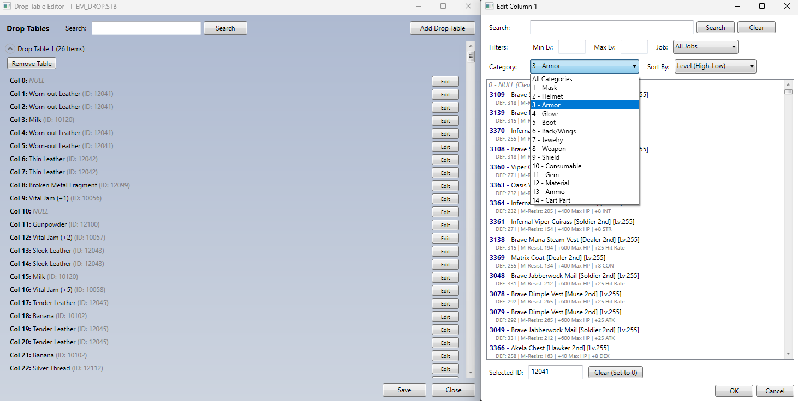

# Drop Table Editor

Edit ROSE Online drop tables.
Also has a handy search feature.

## Needed in launch folder

- DropTableEditor.exe.config
- DropTableEditor.exe

## Usage

1. Open DropTableEditor.exe
2. Search and edit drop tables as needed
3. Save

## Requirements

- .NET Framework 3.5+
- ROSE Online 3DDATA folder with STB files

## Build

msbuild DropTableEditor.sln /p:Configuration=Release /t:Build

## Thanks
Thanks to Brett for the AruaMapEditor

